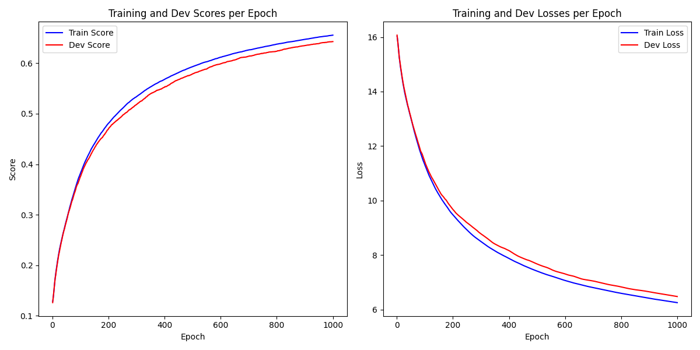

# 三层神经网络分类器构建与图像分类

## 任务介绍

本实验需要手动构建三层神经网络分类器，在[Fashion-MNIST](https://github.com/zalandoresearch/fashion-mnist)数据集上进行训练，并完成图像分类的任务。

## 环境配置
python版本：3.10.14

安装环境：
```
pip install -r requirements.txt
```

## 数据集介绍

Fashion-MNIST数据集：用于图像分类，包含10个类别的服装和配件图片。每张图片都是$28 \times 28$像素的灰度图像，共有60000张训练图片和10000张测试图片。

## 模型设计

本次实验，我设计了一个三层神经网络分类器，包括输入层、隐藏层和输出层：

- 输入层：图像为 $28 \times 28$像素大小，因此输入维度为784；
- 隐藏层：自定义大小，激活函数选择ReLU；
- 输出层：共分10个类别，因此输出维度为10，激活函数选择softmax。

## 实验过程

### 数据预处理
使用fashion_mnist.utils给出的mnist_reader函数读取数据。
```
from fashion_mnist.utils.mnist_reader import load_mnist

X_train, y_train = load_mnist('./fashion_mnist/data/fashion', kind='train')
X_test, y_test = load_mnist('./fashion_mnist/data/fashion', kind='t10k')
```
### 模型构建
主要模块及功能：
- activate.py: 激活函数类定义，包括**ReLU激活函数类**及**Logistic激活函数类**。
- loss_function.py: 损失函数类定义，包括**交叉熵损失函数类**及**softmax函数**。
- op.py: 神经网络算子定义，包括**Linear层类**及三层神经网络模型（**FCNet3类**）。
- optimizer.py: 优化器的定义，包括梯度下降优化器（**SGDOptimizer类**）。
- metric.py: 评价指标的定义，包括**accuracy函数**。
- plot_metrics.py: 可视化训练过程中的指标变化，包括**plot_metrics函数**。
- train.py: 模型训练相关代码
- test.py：模型测试相关代码
- config.py: 配置文件，包含模型各种超参数信息。
    - IN_FEATURES，HIDDEN_SIZE_1，HIDDEN_SIZE_2，OUT_FEATURES：输入层，隐藏层1，隐藏层2，输出层的维度。（输入、输出层不可修改，隐藏层大小可以调整）
    - LR：学习率（可调整）
    - L2：正则化系数（可调整）
    - EPOCH：训练轮数（可调整）
    - DECAY_RATE，DECAY_STEP：本实验中还尝试对学习率进行指数衰减，前者为衰减率，后者为衰减的间隔步数。
    - SAVE_DIR：模型保存路径
    - TEST_EPOCH：用于测试的模型名称

### 训练及测试方法
首先，在config文件中设置好训练或测试参数，之后执行如下代码进行训练或测试。
```
python3 train.py  # 模型训练
python3 test.py  # 模型测试
```


## 实验结果

### 参数搜索
统一设置EPOCH = 1000，正则化系数0.01，学习率1e-3。
#### 1. 隐层大小与正则化


共尝试3种隐层大小：

- $128 \times 64$：无正则化(model_1)测试集最高准确率为66.25%；加正则化(model_9)测试集最高准确率为66.29%。

- $256 \times 64$：无正则化(model_2)测试集最高准确率为67.58%；加正则化(model_10)测试集最高准确率为67.71%。

- $512 \times 128$：无正则化(model_3)测试集最高准确率为74.74%；加正则化(model_8)测试集最高准确率为71.93%。

结论：当**数据集充足**时，模型越大（参数越多），模型的性能越好，正则化对模型没有明显的影响。

#### 2. 学习率

当训练更大的模型（$1024 \times 128$）时，设置学习率为1e-3时，出现loss震荡的现象，如下图所示。(model_4)
<p align="center">

</p>

- 方法1：(model_5)降低学习率为1e-4，测试集最高准确率为63.82%。（原因：学习率国小，收敛速度较慢，1000 epochs 不足以使模型完全收敛）

<p align="center">

</p>

- 方法2：(model_7)使用学习率指数衰减，初始学习率1e-3，衰减率0.99，衰减步数为10 epochs，测试集最高准确率为73.47%。

<p align="center">

</p>

### 训练过程可视化

目前最佳模型：model_3，测试集最高准确率为74.74%，训练过程如下图：

<p align="center">

</p>

## 参考文献

## 附录

### 代码链接

GitHub Repository: [链接](https://github.com/zjx-827/Image_classification)

### 模型权重下载地址

[链接]
